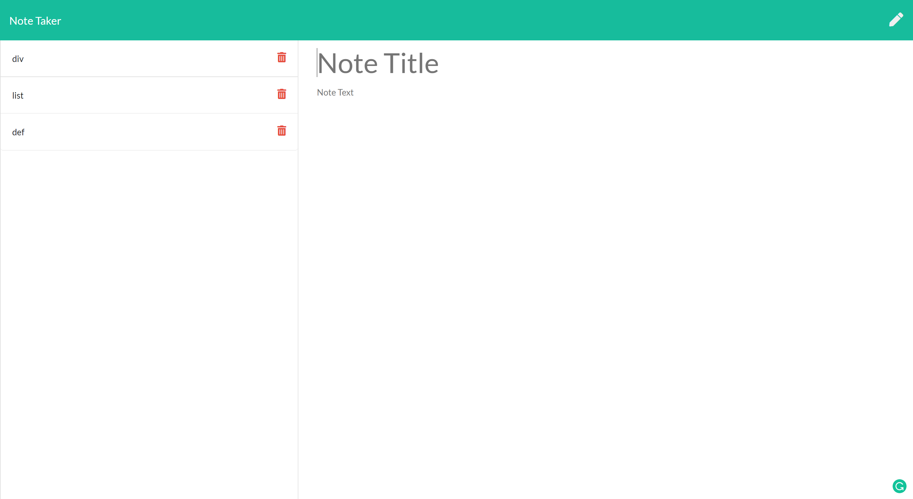

# **Note taker**

>## **_Description_**

It's a note taker that can be used to write and save notes. This application uses an Express.js back end and saves and retrieves note data from a JSON file.

---
### **_Table of Contents_**

* [Installation](#installation)
* [Usage](#usage)
* [Credits](#credits)
* [Features](#features)
* [Contribution](#contribution)
* [License](#license)

>## **_Installation_**
Please open your terminal and run either of these following code:
```
npm start
```
`or`
```
node app.js
```


>## **_Usage_**

Click on the "Get Started" button, you can insert note title and note details and click on the save button on the top right corner. You can click each notes on the left side for checking the details.

**`Wider Screen`**




>## **_Credits_**
I took more than two weeks to finish this project, because I made a small mistake on notes.js and index.js of routes file. I asked the TAs, the instructor, but they didn't find the problem. At last, I figured something wrong and I asked my tutor for help. We fixed the bug.

I think some of TAs don't have work-experience of the homeworks, so sometimes, they have to check challenge requirements again and again. Somehow, they might tell us something wrong! I have a suggestion for interviewing TAs, please let them do several challenges and grade them. 


>## **_Features_**
- Update UI
    - Mobile Friendly
    - Revise Notes
- Save to Database
    - By using SQL
    - Checking Duplicates Data

>## **_Contributing_**

❤️Albert Jiang, ❤️John Blackwell

>## **_License_**


